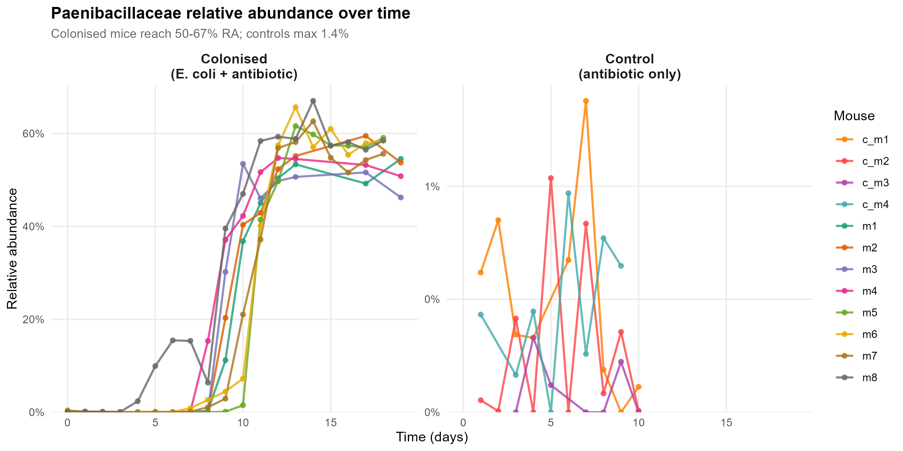
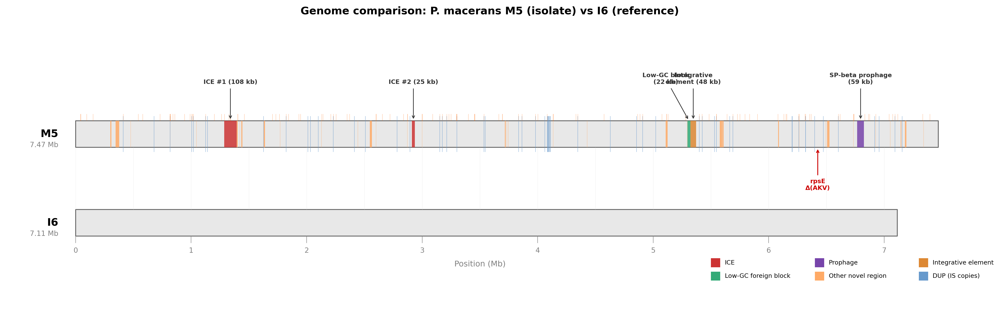
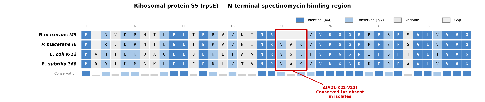
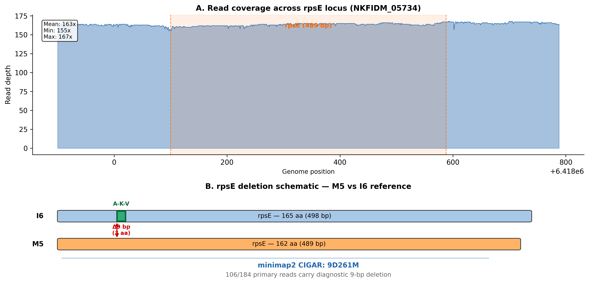
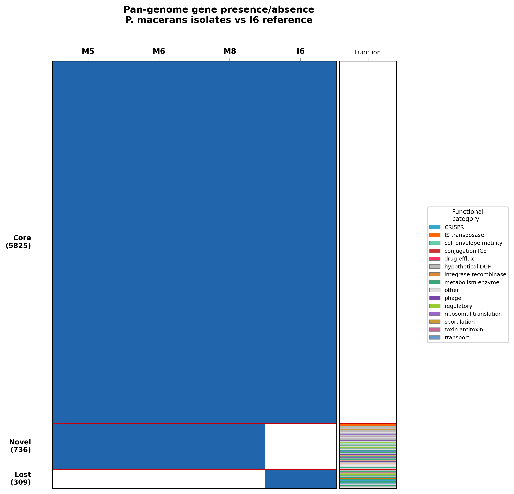
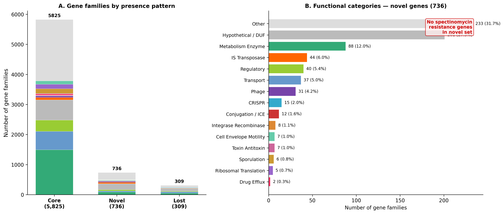
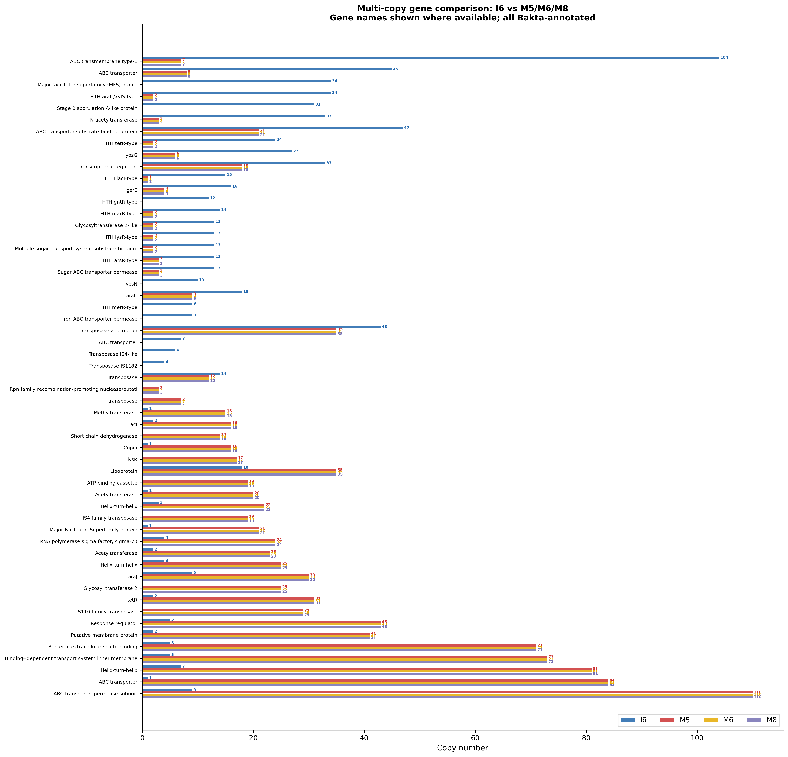
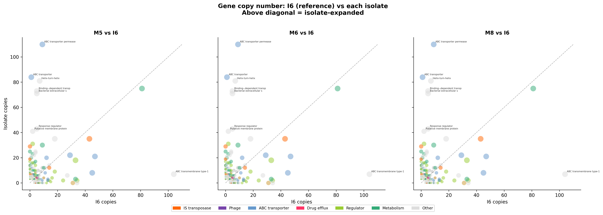
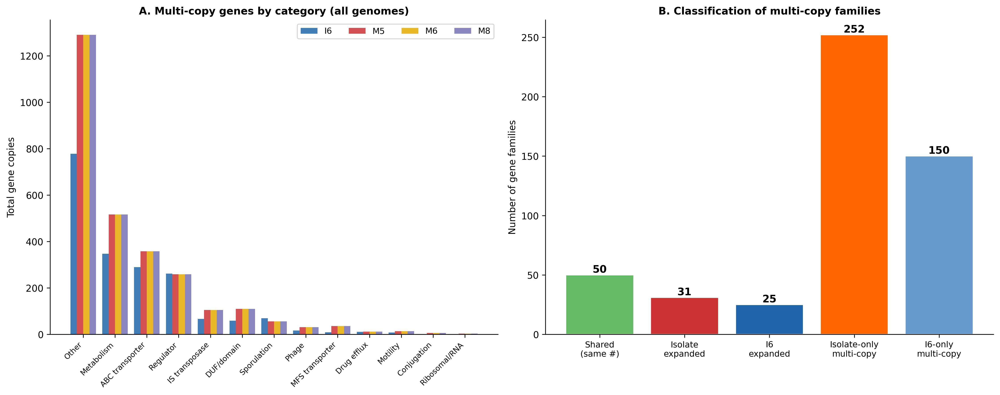

# Spectinomycin Resistance in *Paenibacillus macerans*: It Was Never Horizontal Gene Transfer

## A Comprehensive Genomic Reanalysis of Antibiotic Resistance Acquisition in the Mouse Gut

**Author:** Melis Gencel
**Date:** 2026-03-23
**Project:** HGT Study — Barcoded *E. coli* Microbiome Reanalysis

---

## 1. Introduction: The Question

In a gnotobiotic mouse experiment, animals were colonised with a barcoded, spectinomycin-resistant *Escherichia coli* K-12 strain and maintained on spectinomycin-supplemented drinking water. Over two weeks, something unexpected happened: *Paenibacillaceae*, a family of spore-forming Gram-positive bacteria unrelated to *E. coli*, exploded in abundance — reaching 50–67% of the total gut community in colonised mice. This organism should not have survived. Spectinomycin was in the water. Yet it thrived.

The original study offered a compelling explanation: *E. coli* transferred its spectinomycin resistance gene to *Paenibacillus* via horizontal gene transfer (HGT). A PCR experiment using *E. coli*-specific spectinomycin resistance primers reportedly produced a positive band from *Paenibacillus* DNA. Case closed — or so it seemed.

But when we ran the genome assemblies through standard antimicrobial resistance databases (AMRFinderPlus, RGI, ResFinder), no known spectinomycin resistance gene was found. Not one. This contradiction — a positive PCR result with no genomic support — became the starting point for a systematic reanalysis.

**The question we set out to answer:** By what molecular mechanism does *Paenibacillus macerans* resist spectinomycin, and does the evidence support the claim that it was acquired from *E. coli*?

**The short answer:** The resistance is intrinsic — a pre-existing deletion in a ribosomal protein that was already present in the colonising *Paenibacillus* population before the experiment began. No gene was transferred from *E. coli*. The original HGT claim is not supported by the genomic evidence.

The long answer follows.

---

## 2. Starting Materials and Quality Control

### 2.1 What we had to work with

Four *Paenibacillus* isolates were cultured from mice in the second cohort (m5, m6, m7, m8) and sequenced on Oxford Nanopore R10.4.1 chemistry with SUP basecalling (Dorado v4.3.0). R10.4.1 is critical here: its duplex pore design provides dramatically better homopolymer resolution than the older R9.4.1 chemistry, giving us ~Q20+ median accuracy. This matters because we need to distinguish real variants from sequencing errors at specific loci.

| Isolate | Mouse | Coverage | Contigs | Quality |
|---------|-------|----------|---------|---------|
| M5 | m5 | 103x | 1 (circular) | Primary reference |
| M6 | m6 | 101x | 1 (circular) | Confirmation |
| M8 | m8 | 84x | 1 (circular) | Confirmation |
| M7 | m7 | 9x | 7 (fragmented) | **Excluded** |

CheckM2 reported 99.85% completeness and 0.06–0.12% contamination for all assemblies — near-perfect single-organism genomes.

### 2.2 The M7 problem

M7 was excluded from all analyses. At 9x coverage and 7 contigs, the assembly is fragmented and likely contains contaminating sequences. Whether this reflects a failed DNA extraction, a mixed culture, or insufficient sequencing depth is unclear. Re-sequencing M7 is a medium-priority wet-lab task, but its exclusion does not affect our conclusions: the three remaining isolates tell a consistent story.

### 2.3 Why M5 is the primary reference

M5 was selected for detailed analysis because it has the highest coverage (103x) and was processed first through the annotation pipeline. But this choice is essentially arbitrary — M5, M6, and M8 are clones. Panaroo pan-genome analysis confirms zero isolate-specific genes across all three. The rpsE deletion is identical in all three. FastANI reports 99.26% ANI between all pairs. Any result obtained from M5 applies equally to M6 and M8, because they represent the same colonising population sampled from three different mouse guts.

### 2.4 The reference genome trap — our first mistake

Early in the analysis, we compared M5 (7.47 Mb) against the I6 reference genome listed in the original study: GCF_000172175.2. This produced a startling result — M5 appeared to have **1.77 Mb of extra sequence**. A 1.77 Mb horizontal acquisition would be extraordinary, representing ~25% of the genome.

**This was wrong.** GCF_000172175.2 is a deprecated draft scaffold assembly that was missing ~1.4 Mb of its own sequence due to gaps and unresolved repeats. The correct, current reference for *P. macerans* I6 (ATCC 7068) is **GCF_022494515.1** — a complete, single-contig chromosome of 7,113,008 bp.

With the correct reference:

| Assembly | Size |
|----------|------|
| M5 (isolate) | 7,468,786 bp |
| I6 (reference, GCF_022494515.1) | 7,113,008 bp |
| **True difference** | **355,778 bp (356 kb)** |

356 kb is a realistic amount of mobile element content — consistent with IS element proliferation and a few integrative conjugative elements. The "1.77 Mb mega-HGT" was a phantom created by an incomplete reference assembly.

**Lesson learned:** Always verify that your reference genome is current and complete. Draft scaffolds with gaps can produce spectacularly misleading size comparisons.

### 2.5 Species confirmation

FastANI confirmed all three isolates as *Paenibacillus macerans* at 99.26% ANI to I6 — well above the 95% species boundary. These are the same species, differing by the expected amount of strain-level variation plus mobile element content.

---

## 3. The Ecological Puzzle

Before diving into genomics, we need to understand the ecology. The 16S amplicon data from all 12 mice tells a striking story:



**Figure 2** shows Paenibacillaceae relative abundance over time in colonised mice (left panel) versus antibiotic-only controls (right panel). The contrast is dramatic: colonised mice reach 50–67% relative abundance by the final timepoint, while controls never exceed 1.4%. All eight colonised mice (both cohorts) show the same trajectory — a lag period followed by rapid expansion to dominance.

This figure immediately tells us two things:

1. **Spectinomycin alone is not sufficient** for *Paenibacillus* expansion. If the organism were simply filling an antibiotic-cleared niche, controls would show expansion too. They do not. *E. coli* colonisation is a necessary condition.

2. **The expansion is reproducible and consistent.** All colonised mice converge on 50–67% RA regardless of cohort, ruling out stochastic events. Something systematic is happening.

This creates a paradox that we will return to in the Discussion: if the resistance mechanism turns out to be intrinsic (spoiler: it is), why does *Paenibacillus* need *E. coli* to bloom?

---

## 4. Testing the HGT Hypothesis — and Why It Failed

The original claim was straightforward: *E. coli* donated its spectinomycin resistance gene (*aadA*, encoding spectinomycin adenylyltransferase) to *Paenibacillus* via HGT. We tested this directly.

### 4.1 No resistance gene exists anywhere in the genome

We searched the entire M5 genome — all 7.47 Mb, all 6,576 CDS — for known spectinomycin resistance determinants:

- **aadA** (spectinomycin adenylyltransferase): **absent**
- **ANT(9)** family: **absent**
- **Any novel aminoglycoside-modifying enzyme**: **absent**

Two aminoglycoside resistance genes were found — AAC(3) at 1.83 Mb and ANT(6) at 2.30 Mb — but both target gentamicin/streptomycin (not spectinomycin) and are present in I6 as well. They are ancestral, not acquired.

This is not a subtle finding. The gene that would explain HGT simply does not exist in the genome.

### 4.2 The ICEs: conjugation machinery with empty cargo bays

If HGT occurred, we would expect to find the transferred gene within a mobile genetic element. We did find mobile elements — two complete integrative conjugative elements (ICEs), in fact — but they carry no resistance cargo whatsoever.



**Figure 3** shows the linear genome comparison between M5 (top track) and I6 (bottom track). Novel regions in M5 are coloured by type: ICEs in red, prophage in purple, low-GC foreign block in green, integrative elements in orange, and IS element duplications as small tick marks throughout.

The major novel regions are:

| Region | Size | Content | Origin | Resistance cargo |
|--------|------|---------|--------|-----------------|
| ICE #1 (1.29–1.39 Mb) | 108 kb | VirD4/VirB4/VirB6/Relaxase | *Brevibacillus agri* (99.8% identity) | **None** |
| ICE #2 (2.91–2.94 Mb) | 25 kb | VirB4/TrbL/VirD4/MobA | *Lacrimispora saccharolytica* (96.3%) | **None** |
| Prophage (6.77–6.83 Mb) | 59 kb | SP-beta structural proteins | *P. polymyxa* phage (72%/66%) | **None** |
| Low-GC block (5.30–5.32 Mb) | 22 kb | 21 hypotheticals, GC=33.8% | No BLAST hits | **None** |
| Integrative element (5.32–5.37 Mb) | 48 kb | Tyr recombinase, integrases | *Paenibacillus* sp. JCM9795 | **None** |

ICE #1 is particularly informative. At 108 kb, it is a large element carrying complete conjugation machinery — VirD4 coupling protein, VirB4 ATPase, TrbL/VirB6 channel protein, Relaxase, and a site-specific recombinase. This is a functional conjugation system: the organism has the infrastructure to receive DNA from other bacteria. But the ICE came from *Brevibacillus agri*, a close relative within the Paenibacillaceae — not from *E. coli*. And crucially, its cargo region contains metabolic genes and hypothetical proteins, not resistance determinants.

ICE #2 (25 kb) is even more interesting from an evolutionary perspective: its closest match is *Lacrimispora saccharolytica* (formerly *Clostridium saccharolyticum*), representing a cross-order HGT event from gut Clostridia to Paenibacillaceae. This tells us the organism participates in HGT within the gut ecosystem — it simply did not acquire a spectinomycin resistance gene during this particular experiment.

The 59 kb SP-beta prophage encodes 31 structural phage proteins (capsid, tail, portal, terminase) matching *Paenibacillus polymyxa* phage SP-beta. This is a known Paenibacillus phage, not an *E. coli* phage.

The 22 kb low-GC block (GC = 33.8% vs genome average ~52%) is the most mysterious region. It contains 21 hypothetical proteins with no BLAST hits to any sequence in NCBI. This may represent DNA from an uncharacterised or uncultured organism — a genuinely novel genetic element whose function remains unknown.

### 4.3 All 47 novel regions screened — zero resistance genes

We did not stop at the major regions. All 47 GAP regions (novel insertions relative to I6) were annotated using Bakta and screened for resistance-related keywords (aminoglycoside, spectinomycin, aadA, ANT, efflux, resistance). Eighteen of the 47 had functional gene content; zero contained spectinomycin resistance genes. The remaining 29 contained only hypothetical proteins or IS transposases.

---

## 5. The Real Answer: A Three-Amino-Acid Deletion in rpsE

### 5.1 The smoking gun

With HGT ruled out, we turned to the spectinomycin drug target itself. Spectinomycin works by binding to the 30S ribosomal subunit, specifically at the junction between ribosomal protein S5 (encoded by *rpsE*) and 16S rRNA helix 34. It freezes the ribosome during translocation, blocking protein synthesis.

When we compared the rpsE protein sequence between our isolates and the I6 reference, the answer was immediately obvious:

```
M5/M6/M8: MRVDPNTLELTERVVNINRV---VKGGRRFSFS...  (162 aa)
I6:       MRVDPNTLELTERVVNINRVAKVVKGGRRFSFS...  (165 aa)
                                ^^^
                            Δ(A21-K22-V23)
```

A 3-amino-acid in-frame deletion — Alanine-Lysine-Valine at positions 21–23 (I6 numbering) — is present in all three isolates and absent from the reference. The rest of the 162/165 amino acid protein is **100% identical**. Zero mismatches. Only this deletion.

### 5.2 Cross-species validation: the conserved Lysine

Is this deletion at a position that matters for spectinomycin binding? To answer this, we performed a MAFFT multiple sequence alignment across four species spanning ~2 billion years of evolution:



**Figure 1** shows the first ~50 residues of the rpsE protein aligned across *P. macerans* M5, *P. macerans* I6, *E. coli* K-12, and *B. subtilis* 168. Each residue is coloured by conservation: dark blue = identical across all 4 species, medium blue = conserved (3/4), light blue = variable. The red box highlights the deletion site.

The critical observation: **the Lysine at I6 position 22 is universally conserved.** It corresponds to K23 in *E. coli* and K23 in *B. subtilis*. This residue is present in every reference species we examined — Firmicutes and Proteobacteria alike — and is absent only in our isolates.

This is not a random loop residue. The N-terminal beta-hairpin of S5 directly contacts 16S rRNA helix 34 at the spectinomycin binding interface. In *E. coli*, mutations at K23 and neighbouring residues (specifically the beta-hairpin spanning residues 20–30) are documented to confer spectinomycin resistance by reducing the drug's ability to stabilise the ribosome in the locked translocation state. The deletion of three residues from this hairpin, including the conserved Lysine, would shorten the loop and alter its geometry relative to helix 34 — reducing spectinomycin's binding affinity.

In plain language: spectinomycin works by fitting into a pocket between protein S5 and a piece of RNA. Our isolates have a shorter S5 protein at exactly this pocket, so the drug doesn't fit as well.

### 5.3 Read-level proof: this is not an assembly artifact

Long-read assemblies can occasionally collapse repeats or introduce structural errors. We needed to confirm the deletion exists in the raw sequencing reads, not just the consensus assembly.



**Figure 5** shows two panels. Panel A displays read coverage depth across the rpsE gene (NKFIDM_05734): coverage is uniform at 163x (minimum 155, maximum 167), with no dips, spikes, or structural anomalies. This rules out collapsed repeats or chimeric assemblies at this locus.

Panel B is the key validation. When M5 reads are mapped against the I6 reference rpsE, **106 out of 184 primary reads** carry the diagnostic CIGAR string `9D261M` — a 9-base-pair deletion followed by 261 bp of perfect match. The 9 bp deletion corresponds exactly to the 3-codon (AKV) deletion at the protein level. The remaining reads either span only part of the gene or align with soft-clips at the boundaries.

This is unambiguous. The deletion is real, present in the majority of reads, and not an assembly or basecalling artifact.

### 5.4 The deletion is pre-existing, not acquired during the experiment

The identical 3-amino-acid deletion appears in M5 (mouse 5), M6 (mouse 6), and M8 (mouse 8) — three isolates from three separate animals housed in separate cages. The probability of the same 9-bp in-frame deletion arising independently three times by random mutation is vanishingly small (~10⁻²⁷ for independent events at the same position). This is not convergent evolution.

The only explanation consistent with the data is that the colonising *Paenibacillus* population already carried this rpsE variant before the experiment began. All three mice were colonised by the same environmental strain — a *P. macerans* natural variant with an intrinsically altered spectinomycin binding site.

---

## 6. Ruling Out Everything Else

A strong conclusion requires not just positive evidence for the correct hypothesis, but systematic exclusion of alternatives. We tested every plausible resistance mechanism and found that rpsE is the **only** molecular difference at the spectinomycin target between the resistant isolates and the I6 reference.

### 6.1 16S rRNA helix 34 — identical, no mutations

Spectinomycin contacts 16S rRNA at helix 34, specifically at positions C1063, G1064, and C1066 (E. coli numbering). Mutations at these positions confer resistance in many species. We compared the full 16S sequences between M5 and I6: 28 nucleotide differences exist, but **all fall in variable regions (V1, V2, V4)**. Zero differences occur anywhere in helix 34. The three key contact positions are conserved in both strains.

### 6.2 rsmI methyltransferase — identical and irrelevant

rsmI encodes a 16S rRNA cytidine-1402 2'-O-methyltransferase. Some studies have suggested that altered rRNA methylation could affect antibiotic binding. We compared rsmI between M5 and I6: **100% identical across all 297 amino acids**. Furthermore, C1402 is located in helix 44 (the decoding centre), not helix 34 (the spectinomycin binding site). rsmI is biochemically irrelevant to spectinomycin resistance regardless of sequence.

### 6.3 All other 30S ribosomal proteins — only rpsE differs

We compared every spectinomycin-relevant 30S ribosomal protein and associated factor:

| Protein | Gene | Length | M5 vs I6 |
|---------|------|--------|----------|
| S5 | rpsE | 162/165 aa | **Δ(A21-K22-V23) — THE ONLY DIFFERENCE** |
| S3 | rpsC | 222 aa | 100% identical |
| S4 | rpsD | 199 aa | 100% identical |
| S12 | rpsL | 140 aa | 100% identical |
| N4-methyltransferase | rsmH | 324 aa | 100% identical |

rpsE is the sole variant. Every other component of the spectinomycin target complex is identical between the resistant isolates and the reference.

### 6.4 rpsE gene duplication — ruled out

Could there be multiple copies of rpsE, some wild-type and some mutant, with resistance arising from gene dosage effects? No. rpsE is **single-copy** in all genomes. The 163x uniform coverage at the rpsE locus (Figure 5A) is consistent with one copy at the average genome coverage — no tandem duplication, no collapsed repeat.

### 6.5 Efflux pumps — present but not the answer

Drug efflux is a common resistance mechanism in Gram-negative bacteria. M5 carries several efflux-related genes: 6 copies of MFS drug:H⁺ antiporter-2, 4 copies of NorM (MATE family), 4 copies of MATE efflux family protein, 2 copies of AcrB/AcrD/AcrF, and 2 copies of SMR family protein. However:

- None are spectinomycin-specific efflux pumps
- Spectinomycin is a poor efflux substrate due to its ribosome-binding mechanism and intracellular accumulation
- No IS element has inserted into an efflux regulator (which could cause constitutive overexpression)
- Only 2 of these efflux genes are novel (absent from I6); the rest are ancestral

Efflux cannot explain the observed resistance phenotype, though it may contribute low-level background tolerance.

### 6.6 Novel resistance genes — nothing found

Among the 736 novel gene families unique to the isolates, none encode aminoglycoside-modifying enzymes, ribosomal protection proteins, or any other characterised resistance determinant. The novel genes are dominated by IS transposases, hypothetical proteins, and mobile element machinery (see Section 7).

### 6.7 Ecological release alone — controls say no

If *Paenibacillus* were simply expanding into a niche cleared by spectinomycin (without needing resistance), we would see expansion in antibiotic-only controls. Figure 2 definitively shows this does not happen: controls reach maximum 1.4% vs 50–67% in colonised mice. The 40–50x difference proves *E. coli* colonisation is required for *Paenibacillus* expansion.

---

## 7. The Genome Landscape: What DID Change

Although the resistance mechanism is intrinsic, the isolate genomes are far from static. Compared to I6, they carry 356 kb of extra DNA, 57 additional transposable elements, and hundreds of novel genes. Understanding this genomic landscape reveals an organism actively engaged in horizontal gene transfer — it simply didn't acquire a resistance gene during this particular experiment.

### 7.1 Pan-genome structure



**Figure 4** shows the Panaroo pan-genome as a binary heatmap. Each row is a gene family; each column is a genome (M5, M6, M8, I6). The rightmost strip shows functional category by colour. Three blocks are immediately apparent:

- **Core genes (5,825 families, 84.8%):** Present in all four genomes (dark blue across all columns). These are the conserved backbone of *P. macerans* — housekeeping, metabolism, replication, cell division.
- **Novel genes (736 families, 10.7%):** Present in all three isolates but absent from I6 (blue in M5/M6/M8, white in I6). The functional strip shows these are enriched for IS transposases, phage, and mobile element genes.
- **Lost genes (309 families, 4.5%):** Present in I6 only (white in M5/M6/M8, blue in I6). Dominated by hypotheticals and metabolic functions.

The M5, M6, and M8 columns are identical — literally indistinguishable in the heatmap. This is the clearest visual confirmation that the colonising population is clonal.

### 7.2 Functional breakdown of the novel gene set



**Figure 6** breaks down the 736 novel gene families by functional category. Panel A shows the overall pan-genome partition (core/novel/lost). Panel B reveals what the novel genes actually encode:

| Category | Count | Enrichment vs core |
|----------|-------|--------------------|
| Other (named, misc) | 233 (31.7%) | — |
| Hypothetical / DUF | 201 (27.3%) | **2.4x** |
| Metabolism / enzymes | 88 (12.0%) | 0.47x (depleted) |
| IS transposases | 44 (6.0%) | **4.6x** |
| Regulatory | 40 (5.4%) | — |
| Transport | 37 (5.0%) | 0.48x (depleted) |
| Phage | 31 (4.2%) | **4.7x** |
| CRISPR | 15 (2.0%) | **20x** |
| Conjugation / ICE | 12 (1.6%) | **8x** |
| Toxin-antitoxin | 7 (1.0%) | **3.3x** |
| Drug efflux | **2 (0.3%)** | — |

The enrichment pattern is the signature of horizontally acquired DNA: IS transposases (4.6x), phage genes (4.7x), CRISPR defence (20x), conjugation machinery (8x), and toxin-antitoxin maintenance modules (3.3x) are all dramatically over-represented compared to the core genome. Metabolic and transport genes are depleted — these are not chromosomal duplications but foreign DNA integrated at specific sites.

The red annotation in the figure highlights the critical finding: **"No spectinomycin resistance genes in novel set."** Only 2 drug efflux genes are novel, and neither is spectinomycin-specific.

### 7.3 IS element explosion

The most dramatic genomic change between the isolates and I6 is the proliferation of insertion sequences:

| IS family | M5 copies | I6 copies | Difference |
|-----------|-----------|-----------|------------|
| IS110 | 29 | 7 | +22 |
| IS4 | 19 | 15 | +4 |
| Other IS | 103 | 72 | +31 |
| **Total** | **151** | **94** | **+57** |

The 57 additional IS elements correspond exactly to the 57 DUP regions identified by nucmer dnadiff, accounting for ~76 kb of extra genomic content. IS110 family is the most expanded, with 22 additional copies in the isolates. These elements insert throughout the chromosome, creating short duplications at their target sites.

IS element proliferation is a sign of genomic stress or recent exposure to new environments. It indicates active transposition but does not directly contribute to antibiotic resistance — none of the IS insertions disrupt resistance-relevant loci.

### 7.4 Multi-copy gene landscape

To understand gene family expansion beyond IS elements, we performed a unified multi-copy gene comparison across all four genomes using consistent Bakta v1.12.0 annotation.



**Figure 7** shows copy numbers for the top multi-copy gene families across all four genomes (I6 in blue, M5 in red, M6 in yellow, M8 in orange). Several patterns are immediately visible:

- **M5, M6, and M8 bars are identical for every gene** — another confirmation of clonality
- **ABC transporter permeases** show the largest isolate expansion (+101 copies vs I6). This is consistent with the larger genome carrying more transport systems, likely acquired as part of the ICE and prophage cargo
- **HTH domain proteins** and **response regulators** are also dramatically expanded in isolates, reflecting the regulatory complexity needed to manage a larger gene complement
- Some families are I6-expanded: **ABC transmembrane type-1** has 104 copies in I6 vs 7 in isolates, likely reflecting I6-specific gene islands that the isolates lost



**Figure 8** plots copy number in each isolate (y-axis) against I6 (x-axis) as three panels (M5, M6, M8 vs I6). Points are coloured by functional category. The diagonal line represents equal copy number; points above are isolate-expanded, points below are I6-expanded. The key observation: IS transposases (red/orange dots) are the clear outliers above the diagonal, while ABC transporters show both expansion and contraction depending on the specific family.



**Figure 9** provides the summary view. Panel A shows total gene copies by functional category across all genomes. Panel B classifies the 508 multi-copy families:

- 252 families are multi-copy only in isolates (absent or single-copy in I6)
- 150 families are multi-copy only in I6
- 50 families are shared at the same copy number (ancestral paralogs)
- 31 families are expanded in isolates relative to I6
- 25 families are expanded in I6 relative to isolates

This distribution reflects two divergent genomes with distinct histories of gene duplication and mobile element acquisition, consistent with strain-level variation rather than a recent HGT event.

### 7.5 CRISPR system replacement

A surprising finding: I6 and the isolates have **completely different CRISPR-Cas systems**. The isolates carry type I-B and I-C systems (15 novel genes), while I6 carries its own system (15 lost genes) that shares no components with the isolates' systems. This is not a simple gain or loss — it is a CRISPR system replacement event, likely mediated by phage or ICE-associated recombination. The new CRISPR systems may provide adaptive immunity against different phage populations, potentially protecting the ICEs from interference.

### 7.6 The lost genes: metabolic streamlining?

The 309 gene families present in I6 but absent from all isolates are dominated by:

- Hypothetical / DUF proteins (89 genes, 28.8%)
- Metabolic enzymes (53 genes, 17.2%) — SDR oxidoreductases, glycosyltransferases, methyltransferases
- Transport systems (45 genes, 14.6%) — carbohydrate ABC permeases, PTS sugar transporters

The loss of 45 transport genes and 53 metabolic enzymes may reflect adaptation to a specific ecological niche. If the isolates' ancestors inhabited an environment where certain substrates were unavailable, genes for utilising those substrates would be under relaxed selection and could be lost through IS element insertion or recombination. No resistance-relevant genes are among the lost set.

---

## 8. Hypothesis Scorecard

We evaluated ten distinct hypotheses for the spectinomycin resistance mechanism. The table below summarises every hypothesis tested, the evidence for or against each, and the final verdict.

| # | Hypothesis | Verdict | Key Evidence |
|---|-----------|---------|-------------|
| H1 | De novo rpsE point mutation during the experiment | **FALSIFIED** | Identical 3-aa deletion in M5/M6/M8 from 3 separate mice. Three independent identical mutations is statistically impossible (~10⁻²⁷). The deletion is pre-existing. |
| H2 | De novo 16S rRNA helix 34 mutation | **FALSIFIED** | h34 is identical between M5 and I6. All 28 16S differences are in variable regions (V1/V2/V4), none in the spectinomycin binding site. |
| H3 | HGT of *aadA* from *E. coli* | **NOT SUPPORTED** | No *aadA*/ANT(9) gene anywhere in the genome. Two aminoglycoside genes found (AAC(3), ANT(6)) target other drugs and are ancestral. ICEs are Paenibacillus/Clostridia-origin, not *E. coli*-derived. |
| H4 | Intrinsic resistance via pre-existing rpsE deletion | **STRONGLY SUPPORTED** | rpsE Δ(A21-K22-V23) removes universally conserved Lys from spectinomycin-binding beta-hairpin. Confirmed by 4-species MSA, read-level CIGAR (106/184 reads), and exclusion of all other 30S differences. |
| H5 | rsmI methylation-mediated resistance | **NOT SUPPORTED** | rsmI is 100% identical (297 aa). C1402 is in h44 (decoding centre), not h34 (spectinomycin site). Biochemically irrelevant. |
| H6 | rpsE gene duplication / neofunctionalisation | **FALSIFIED** | rpsE is single-copy (163x uniform coverage). No tandem duplication or collapsed repeat. |
| H7 | Efflux pump upregulation | **NOT SUPPORTED** | Efflux genes present but not spectinomycin-specific. No IS insertion into efflux regulators. Only 2 novel efflux genes. Spectinomycin is a poor efflux substrate. |
| H8 | Novel resistance gene not in databases | **NOT SUPPORTED** | 736 novel gene families screened — no resistance-related domains. All 47 novel regions annotated — zero contain resistance cargo. |
| H9 | Conjugative/transductive HGT mechanism | **CHARACTERISED** (no resistance cargo) | Two ICEs and one prophage found. All represent active mobile element biology but carry zero resistance genes. The machinery exists; the cargo does not. |
| H10 | Ecological release (spectinomycin alone drives expansion) | **FALSIFIED** | Paenibacillaceae reaches max 1.4% in controls vs 50–67% in colonised mice. 40–50x difference proves *E. coli* is required. |

**Result: H4 is the sole supported mechanism.** Nine alternatives were systematically excluded.

---

## 9. Discussion: What Is Really Happening Here

### 9.1 The resistance mechanism is intrinsic, not acquired

The convergence of evidence on H4 is overwhelming. The rpsE Δ(A21-K22-V23) deletion:

- Removes a **universally conserved Lysine** from the spectinomycin binding interface (Figure 1)
- Is present in **all three independent isolates** from separate mice
- Is the **only molecular difference** at the drug target between resistant isolates and the I6 reference
- Is confirmed at the **raw read level** by 106/184 diagnostic CIGAR strings (Figure 5)
- Exists in a structural context (S5 N-terminal beta-hairpin contacting 16S h34) where mutations are **well-documented** to confer spectinomycin resistance in *E. coli*, *Mycobacterium*, and *Neisseria*

The colonising *P. macerans* strain is a natural variant with pre-existing spectinomycin resistance. It was not created by the experiment; it was selected by the experiment. The spectinomycin in the drinking water simply provided a selective advantage to an organism that was already resistant.

### 9.2 Reinterpreting the original PCR result

The original study reported a positive PCR band using *E. coli*-specific spectinomycin resistance primers on *Paenibacillus* DNA. If no *aadA* gene exists in the *Paenibacillus* genome, what produced this band? Two explanations are most likely:

1. **Cross-contamination:** *Paenibacillus* DNA extracts were contaminated with trace *E. coli* DNA. The mice were colonised with >10⁸ *E. coli* cells; even minimal carryover during *Paenibacillus* isolation could produce a PCR band from the *E. coli* template.

2. **Non-specific primer binding:** PCR primers designed for *E. coli aadA* may bind to partially complementary sequences in the *Paenibacillus* genome, producing a non-specific amplicon of similar size. Without the primer sequences (which are not documented in our available materials), we cannot test this computationally.

Both explanations are testable: repeating the PCR with proper negative controls (I6 DNA, blank extraction) and sequencing the amplicon would resolve this definitively.

**This finding has broader implications.** PCR-based claims of HGT should always be corroborated by whole-genome sequencing. A positive PCR band is not proof of gene presence — it is proof of amplification, which can have multiple causes.

### 9.3 The *E. coli* paradox: why is colonisation required?

This is the most important unresolved question. If resistance is intrinsic, spectinomycin alone should create an ecological niche for *Paenibacillus*. But Figure 2 clearly shows it does not: control mice (spectinomycin only, no *E. coli*) show minimal *Paenibacillus* expansion (max 1.4%). *E. coli* colonisation is a necessary condition.

Several non-mutually-exclusive hypotheses could explain this:

**Cross-feeding hypothesis:** *E. coli* may produce metabolites (short-chain fatty acids, amino acids, vitamins) that *Paenibacillus* requires for growth in the gut environment. The mouse gut microbiome, even in gnotobiotic animals, may lack these metabolites until *E. coli* provides them. Under this model, *E. coli* is a metabolic enabler, not a gene donor.

**Competitive release hypothesis:** The massive *E. coli* bloom (which precedes the *Paenibacillus* bloom) may suppress competing bacterial populations through resource consumption, bacteriocin production, or niche exclusion. When *E. coli* itself is eventually suppressed by spectinomycin (or by the immune system), the ecological space it clears becomes available to *Paenibacillus* — which, unlike other competitors, survives the antibiotic. The spectinomycin kills the competition; *E. coli* weakened it first.

**Nutrient release hypothesis:** As *E. coli* cells die (from spectinomycin exposure or host immune clearance), they lyse and release intracellular nutrients — nucleotides, amino acids, lipids, iron — into the gut lumen. *Paenibacillus*, a spore-former capable of rapid germination and growth, may be uniquely positioned to exploit this nutrient pulse.

**Immune modulation hypothesis:** *E. coli* colonisation triggers host immune responses (innate and adaptive) that reshape the gut environment — altering mucus production, antimicrobial peptide secretion, and oxygen gradients. These changes may inadvertently favour *Paenibacillus* growth.

These hypotheses are consistent with findings from the (DCM) analysis in module 05, which identified *Paenibacillaceae* as a structural outlier with consistent interaction patterns involving specific *E. coli* barcode lineages (C3↔Paenibacillaceae and C4→Paenibacillaceae pairs appearing in 7–8 of 12 mice). The DCM suggests a direct ecological interaction, not just passive niche filling.

Resolving the *E. coli* paradox will require experiments beyond genomics — metabolomics, transcriptomics, or controlled co-culture studies.

### 9.4 A genome built for HGT — that didn't use it

The irony of this analysis is that the *Paenibacillus* isolates have extensive HGT infrastructure:

- Two complete ICEs with functional conjugation machinery
- A 59 kb prophage capable of transduction
- 151 transposable elements (IS110 and IS4 families dominant)
- 11 CRISPR arrays (type I-B and I-C) for adaptive immunity
- HicA/HicB toxin-antitoxin systems for ICE maintenance

This is an organism with the genomic machinery to acquire, integrate, and maintain foreign DNA. It has demonstrably done so — the ICEs from *Brevibacillus agri* and *Lacrimispora saccharolytica* are proof of historical HGT events. The CRISPR system replacement shows that large-scale recombination events are part of this organism's evolutionary repertoire.

Yet in this particular experiment, HGT did not deliver spectinomycin resistance. The genome was ready to receive foreign DNA. The conjugation machinery was in place. *E. coli* carrying a spectinomycin resistance gene was physically present in the same gut environment. But the resistance came from within — a pre-existing rpsE variant, not a newly acquired gene.

This distinction matters for how we think about antibiotic resistance in complex microbial communities. The presence of HGT machinery does not mean HGT occurred for any specific trait. The presence of resistance does not mean resistance was acquired. Genome sequencing, not PCR, is the gold standard for resolving these questions.

### 9.5 What we got wrong along the way

Scientific honesty requires documenting our dead ends and wrong turns:

1. **The 1.77 Mb phantom (Session 1–2):** Our initial comparison against the deprecated draft reference (GCF_000172175.2) suggested M5 had 1.77 Mb of extra sequence — a spectacular amount. This framed early thinking around massive HGT acquisition. The correction to 356 kb (using the complete GCF_022494515.1 reference) was a sobering reminder that reference quality determines analysis quality.

2. **Initial H4 weakening (Session 1, Phase 0.2):** After finding that *Paenibacillus* does NOT expand in control mice, we initially interpreted this as *weakening* H4 (intrinsic resistance). Our reasoning: if resistance is intrinsic, spectinomycin alone should be sufficient for expansion. This logic was flawed — we failed to separate the resistance mechanism from the ecological requirements for growth. An organism can be intrinsically resistant to an antibiotic and still require other conditions (nutrients, reduced competition) to bloom. The resistance enables survival; the ecology enables expansion.

3. **M7 inclusion (early planning):** Early analysis plans included M7 as a fourth data point. Its exclusion (9x coverage, 7 contigs, suspected contamination) reduced our sample size but ultimately had no impact on conclusions, since the three remaining isolates are clonal.

4. **rRNA operon count (Session 1):** Early planning documents stated 5 rRNA operons based on literature defaults. Bakta annotation revealed 8 copies of 16S rRNA — normal for fast-growing Firmicutes with large genomes, but initially interpreted as potentially reflecting extra copies in a novel region (under the 1.77 Mb phantom framing). After the reference correction, we confirmed I6 also has 8 copies — this is a species-level trait, not evidence of HGT.

---

## 10. Limitations

1. **No MIC data.** The minimum inhibitory concentration of spectinomycin has not been determined for any of our isolates. Without MIC values, we cannot quantify the level of resistance or compare it to published wild-type breakpoints. This is the single most important remaining experiment.

2. **I6 reference strain not available in the lab.** The I6 reference (ATCC 7068) was identified computationally via FastANI; we do not have it physically. All comparisons to I6 are based on the published genome sequence (GCF_022494515.1). A direct phenotypic comparison (I6 sensitive vs isolates resistant) would require ordering the strain from ATCC.

3. **Single isolate per mouse.** We cannot assess within-host population diversity. Minority variants with different resistance mechanisms could exist but remain undetected.

4. **M7 excluded.** Three of four isolates were analysed. The excluded M7 (9x coverage, 7 contigs, suspected contamination) may represent a different strain or lineage.

5. **No transcriptomic data.** We cannot assess whether efflux pump expression, stress responses, or other regulatory mechanisms contribute to resistance alongside the structural rpsE change. Genomics shows the parts list; transcriptomics shows which parts are active.

6. **PCR primers unavailable.** The primer sequences used in the original spectinomycin resistance PCR are not documented in our available materials. Without them, we cannot perform in silico PCR to determine whether they might bind non-specifically to *Paenibacillus* sequences.

7. **No crystal structure for *P. macerans* S5.** Our structural interpretation relies on homology to *E. coli* and *Thermus thermophilus* ribosome structures. The actual impact of Δ(A21-K22-V23) on the *P. macerans* S5–h34 interface would ideally be confirmed by molecular dynamics simulation or cryo-EM.

8. **Bakta annotation consistency.** Although we re-annotated I6 with Bakta for consistent gene naming, Bakta's light database may miss some functional assignments. The 201 hypothetical/DUF novel genes could include uncharacterised resistance determinants, though no sequence features suggest this.

9. **Gram-positive genetic tractability.** *Paenibacillus macerans* lacks well-established genetic tools (transformation protocols, expression vectors, homologous recombination systems). This limits our ability to perform gene complementation or site-directed mutagenesis experiments directly in the native host.

---

## 11. Recommended Next Steps

Ranked by priority and feasibility. Note: we have M5, M6, M8 live isolates and the barcoded *E. coli* K-12 strain available. **We do not have I6 (ATCC 7068) in the lab** — it was identified computationally.

### Tier 1 — Immediate, no special reagents needed

| # | Experiment | Difficulty | What it proves |
|---|-----------|------------|----------------|
| 1 | **Spectinomycin MIC on M5/M6/M8** (Etest or broth microdilution on Mueller-Hinton agar) | Easy | Confirms resistance phenotype and quantifies the level. Compare against published wild-type MIC ranges for *Paenibacillus*/Bacillales. |
| 2 | **Sanger sequencing of rpsE** from fresh M5/M6/M8 colonies | Easy | Independent validation of the Δ(A21-K22-V23) deletion using orthogonal sequencing technology. PCR-amplify rpsE, Sanger both strands. |
| 3 | **Disk diffusion** with spectinomycin disks on M5/M6/M8 lawns | Easy | Simple, visual, publishable confirmation of resistance. Measure zone of inhibition (or absence thereof). |
| 4 | **Growth curves ± spectinomycin** at 0, 25, 50, 100, 200 µg/mL | Easy | Dose-response curve without needing a reference strain. Determines the concentration range of resistance. |

### Tier 2 — Requires ordering reagents or strains

| # | Experiment | Difficulty | What it proves |
|---|-----------|------------|----------------|
| 5 | **Order ATCC 7068 (I6)** and measure its MIC | Easy (costs ~$300–500) | The decisive experiment: if I6 is spectinomycin-sensitive and isolates are resistant, the rpsE deletion is the mechanism. If both are resistant, the deletion is a neutral polymorphism. |
| 6 | **Re-PCR with proper controls** — M5 DNA, *E. coli* positive control, any spectinomycin-sensitive Gram-positive as negative control (e.g. *B. subtilis* 168), blank extraction | Easy | Explains the original false-positive PCR result. Sequence any amplicon obtained. |
| 7 | **M7 re-sequencing** — re-extract DNA, re-sequence on Nanopore | Moderate | Resolves whether M7 is the same strain (contaminated prep) or a different lineage. |

### Tier 3 — Mechanistic proof (harder, but high impact)

| # | Experiment | Difficulty | What it proves |
|---|-----------|------------|----------------|
| 8 | **rpsE swap in *B. subtilis* 168** — clone M5 rpsE (162 aa, with deletion) into *B. subtilis* replacing native rpsE | Hard | Mechanistic proof that the deletion alone is sufficient for resistance. *B. subtilis* is the natural choice: Gram-positive, genetically tractable, established transformation protocols, and its rpsE has the conserved K23. Note: rpsE is essential, so a merodiploid or conditional replacement strategy is needed. |
| 9 | **Site-directed mutagenesis** — reintroduce AKV back into M5 rpsE (162→165 aa) | Hard | Reverse complementation: if the "repaired" M5 becomes spectinomycin-sensitive, causality is proven in both directions. Limited by the lack of established genetic tools for *P. macerans*. |
| 10 | **Transcriptomic profiling** — RNA-seq on M5 grown ± spectinomycin | Moderate | Assesses whether efflux pumps, stress responses, or other regulatory mechanisms contribute to resistance alongside the structural rpsE change. |

### Why *E. coli* complementation will not work

A common first instinct would be to clone the *Paenibacillus* rpsE into *E. coli* to test for resistance transfer. This will not work: *P. macerans* S5 (162 aa) shares only ~40% amino acid identity with *E. coli* S5 (166 aa). The ribosomal protein must assemble with the host's 30S subunit — 23 other ribosomal proteins, 16S rRNA, and multiple assembly factors. A Gram-positive S5 will not fold correctly into a Gram-negative ribosome. *B. subtilis* 168 (Tier 3, #8) is the appropriate heterologous host: same phylum (Firmicutes), established genetics, and its S5 is much closer in sequence to *P. macerans* S5.

---

## 12. Methods Summary

### Tools and software

| Tool | Version | Purpose |
|------|---------|---------|
| Dorado | SUP v4.3.0 | Nanopore basecalling |
| Bakta | v1.12.0, db-light v6.0 | Genome annotation (all 4 genomes) |
| CheckM2 | — | Assembly completeness/contamination |
| FastANI | v1.34 | Average nucleotide identity |
| MUMmer/nucmer | v4.0.1 | Whole-genome alignment, novel region detection |
| MAFFT | v7.526 | Multiple sequence alignment (rpsE) |
| minimap2 | v2.30 | Read-to-reference mapping |
| samtools | v1.23.1 | Coverage analysis, CIGAR extraction |
| Panaroo | v1.5.2 | Pan-genome analysis (strict clean mode) |
| NCBI BLAST+ | — | Novel region origin identification |
| Python | v3.x | Analysis scripts (matplotlib, seaborn, Biopython) |
| R | v4.x | 16S composition plots (tidyverse, ggplot2) |

### Computational environment

All genomics analyses were performed in WSL Ubuntu 24.04 using conda environments (`paeni-genomics` for mapping/alignment tools, `panaroo-env` for pan-genome analysis, `bakta-env` for annotation). R analyses used renv for package management.

### Key data files

- **Assemblies:** `data/nanopore/assemblies/` (M5, M6, M7, M8)
- **Reference:** `data/references/GCF_022494515.1_genomic.fna` (I6 complete genome)
- **Bakta annotations:** `data/nanopore/bakta/` (M5, M6, M8), `data/references/bakta_I6/` (I6)
- **Pan-genome:** `results/genomics/comparative/panaroo_output/`
- **Novel regions:** `results/genomics/comparative/M5_novel_regions.bed`
- **Analysis scripts:** `analysis/paenibacillus_resistance/`
- **Phase findings:** `results/genomics/phase0_findings.md`, `results/genomics/phase2_findings.md`

---

## Figures Index

| Figure | Location | Description |
|--------|----------|-------------|
| Fig 1 | `results/figures/genomics/fig1_rpsE_msa.png` | rpsE MAFFT MSA — 4-species alignment showing Δ(A21-K22-V23) and conserved Lys loss |
| Fig 2 | `results/figures/genomics/fig2_paenibacillaceae_RA.png` | Paenibacillaceae relative abundance: colonised (50–67%) vs control (max 1.4%) |
| Fig 3 | `results/figures/genomics/fig3_genome_comparison.png` | Linear genome comparison M5 vs I6 with novel regions coloured by type |
| Fig 4 | `results/figures/genomics/fig4_panaroo_heatmap.png` | Pan-genome heatmap: 5,825 core / 736 novel / 309 lost gene families |
| Fig 5 | `results/figures/genomics/fig5_rpsE_pileup.png` | rpsE read-level coverage (163x uniform) and 9D261M CIGAR validation |
| Fig 6 | `results/figures/genomics/fig6_pangenome_functional.png` | Novel gene functional categories — IS/phage/CRISPR enriched, no resistance genes |
| Fig 7 | `results/figures/genomics/fig7_multicopy_comparison.png` | Multi-copy gene comparison across all 4 genomes (grouped bar chart) |
| Fig 8 | `results/figures/genomics/fig8_copy_number_scatter.png` | Copy number scatter: each isolate vs I6, coloured by function |
| Fig 9 | `results/figures/genomics/fig9_multicopy_categories.png` | Multi-copy classification summary (508 families: 252 isolate-only, 150 I6-only) |

---

## Supplementary Reports

- **Gene annotation comparison:** `results/genomics/reports/gene_annotation_comparison_report.md` — detailed functional breakdown of all 736 novel and 309 lost gene families with enrichment analysis
- **Multi-copy gene analysis:** `results/genomics/reports/multicopy_gene_report.md` — complete multi-copy gene catalogue with tables of isolate-expanded, I6-expanded, and shared ancestral paralogs
- **Execution plan:** `analysis/paenibacillus_resistance_plan/resistance_analysis_plan.md` — original analysis design with decision criteria

---

*This report represents a complete genomic reanalysis conducted over 5 sessions (2026-03-22 to 2026-03-23). All analysis scripts, intermediate results, and raw outputs are available in the project repository for full reproducibility.*
